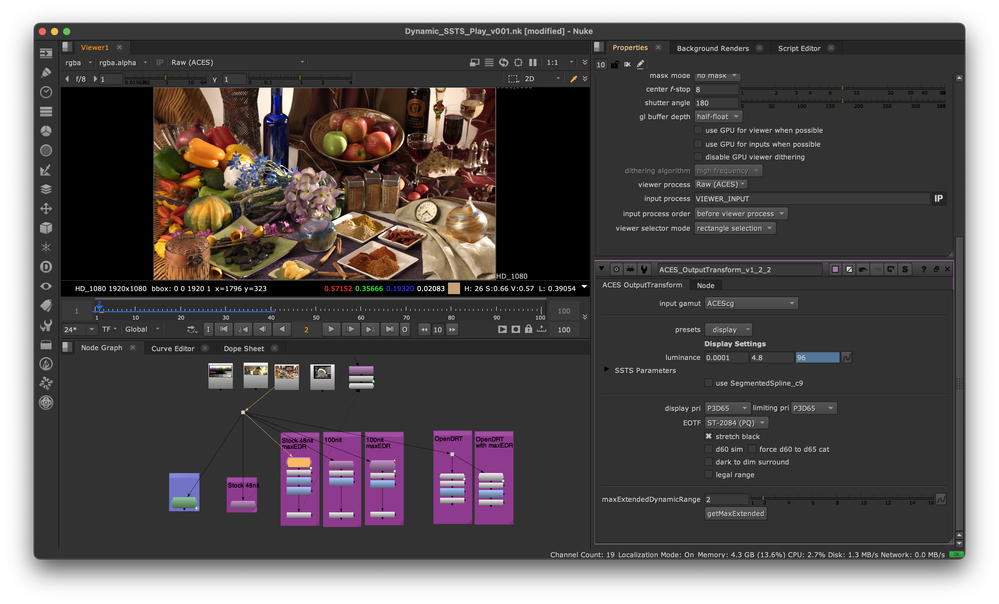

# OTPlay
 ACES Output Transform Playground:

Nuke script demoing 2 approaches for dynamically using SSTS parameters for HDR display on a MacBook Pro 16.

Nukescript will need `/Users/afry/Desktop/hdr.swift` repathed to whereever you put `hdr.swift`

setBrightness.py requires the external CLI `brightness` tool from here: https://github.com/nriley/brightness